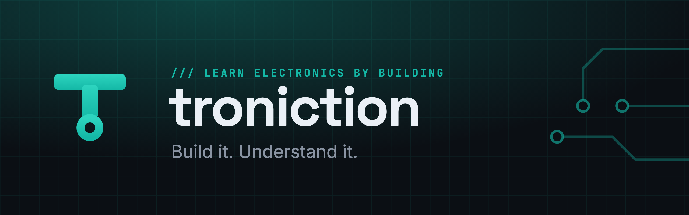

### Build your first Arduino car.

I teach real electronics by building real things. You start with a Bluetooth-controlled car you assemble from scratch — no soldering, no prior electronics — and I explain every part on the way, so the feeling at the end isn't "I followed instructions," it's "I can make things."

---

**`/// START HERE`**

1. **[The free build guide](https://troniction.com)** — the whole car, one ordered step at a time.
2. **[arduino-bluetooth-car](https://github.com/troniction/arduino-bluetooth-car)** — the code that goes on the board.
3. **[Watch the builds](https://youtube.com/@troniction)** — every step on video.
4. **[Stuck? The fixes](https://troniction.com/blog)** — car won't connect, motors won't spin.

**`/// ON THE BENCH`**

`Arduino Uno` · `HC-06 Bluetooth` · `L298N motor driver` · `18650 cells` · `C++ / Arduino IDE`

New build guides and fixes land on <a href="https://troniction.com">troniction.com</a> first.
